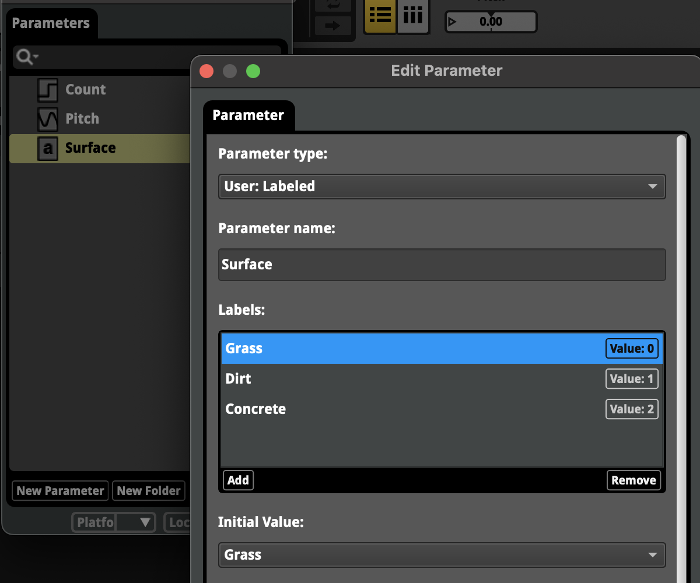

## fmod_parameter_codegen.py

Generates Unity C# code for the parameters of an FMOD Studio project.

You'll be able to write this:

```csharp
public class FootstepPlayer : Component
{
    [SerializeField] EventReference footstepEvent;
    
    public void PlayFootstep(FmodParameters.Surface surface, float strength)
    {
        // The FmodParameters class is generated by fmod_parameter_codegen.py, see below.
        EventInstance footstepEventInstance = RuntimeManager.CreateInstance(footstepEvent);
        footstepEventInstance.setParameterByID(FmodParameters.Surface, (float)surface);
        footstepEventInstance.setParameterByID(FmodParameters.Strength, strength);
        footstepEventInstance.start();
    }
}
```

Instead of needing all of this:

```csharp
public class FootstepPlayer : Component
{
    public enum Surface
    {
        Grass,
        Dirt,
        Concrete
    }
    
    [SerializeField] EventReference footstepEvent;
    
    string surfaceParameterName = "Surface";
    string strengthParaneterName = "Strength";
    
    PARAMETER_ID surfaceParameterID;
    PARAMETER_ID strengthParameterID;

    public void PlayFootstep(Surface surface, float strength)
    {
        EventInstance footstepEventInstance = RuntimeManager.CreateInstance(footstepEvent);
        footstepEventInstance.setParameterByID(surfaceParameterID, (float)surface);
        footstepEventInstance.setParameterByID(strengthParameterID, strength);
        footstepEventInstance.start();
    }
    
    void Start()
    {
        // You could skip getting the parameter ID and only ever use setParameterByName,
        // but that would require FMOD to do a GUID lookup every time PlayFootstep is called.
        surfaceParameterID = GetParameterID(footstepEvent, surfaceParameterName);
        strengthParameterID = GetParameterID(footstepEvent, strengthParameterID);
    }
    
    static PARAMETER_ID GetParameterID(EventReference eventReference, string parameterName)
    {
        EventDescription description = RuntimeManager.GetEventDescription(eventReference);
        description.getParameterDescriptionByName(parameterName, out var paramDescription);
        return paramDescription.id;    
    }
}
```

This is:
1. Safer, because you never need to hardcode string parameter names.
1. Efficient, because you never need to make an FMOD API runtime call to resolve GUIDs.
1. Fun, because you don't need to write so much boilerplate.
1. Maintainable, because any change to the FMOD Studio project will automatically go into code.
1. Documenting, because of the docstrings that are generated for the min/max/initial values.  

Taking this Footstep example, if your FMOD Studio parameters look like this:



And you run `fmod_parameter_codegen.py` like this:

```commandline
scripts/fmod_parameter_codegen.py Path/To/FMODProject
```

You'll generate this:

```csharp
// Generated with fmod_parameter_codegen.py (https://github.com/kalman/fmod-tools)

using FMOD.Studio;

public class FmodParameters
{
    public enum SurfaceLabel
    {
        Grasss,
        Dirt,
        Concrete,
    }

    /// <summary>
    /// "Pitch" (float)<br/>
    /// Min: -12<br/>
    /// Max: 12<br/>
    /// Initial: 0
    /// </summary>
    public static readonly PARAMETER_ID Pitch = new() { data1 = 2762041843, data2 = 3837889405 };

    /// <summary>
    /// "Count" (int)<br/>
    /// Min: 0<br/>
    /// Max: 11<br/>
    /// Initial: 1
    /// </summary>
    public static readonly PARAMETER_ID Count = new() { data1 = 90685309, data2 = 4195628531 };

    /// <summary>
    /// "Surface" (SurfaceLabel)<br/>
    /// Initial: SurfaceLabel.Grasss
    /// </summary>
    public static readonly PARAMETER_ID Surface = new() { data1 = 4265537963, data2 = 2417074898 };

    public const float InitialPitchValue = 0f;
    public const int InitialCountValue = 1;
    public const SurfaceLabel InitialSurfaceValue = SurfaceLabel.Grasss;
}
```

There are a few command line options for renaming the file and adding a namespace.

Notes:
- Only works with access to the FMOD Studio project save file.
- Tested with FMOD 2.02 and 2.03. If the FMOD save format or GUID serialisation formats change then I'll fix the script.
- Tested on some pretty large and complex FMOD projects.
